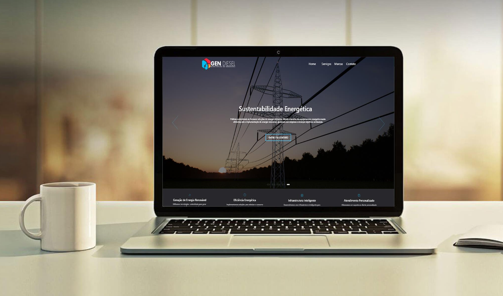

# Gendiesel 



O Gendiesel é um site dedicado a fornecer soluções de energia confiáveis e sustentáveis para residências e empresas. Com foco em serviços de instalação manutenção em geradores.

## Protótipo
Confira o [protótipo no Adobe XD](https://xd.adobe.com/view/53266988-65bc-4487-9be1-6d502bd0fd24-0675/).

## Instruções de Instalação

Siga os passos abaixo para configurar o ambiente local e iniciar o projeto.

### Pré-requisitos

Certifique-se de ter as seguintes ferramentas instaladas em seu sistema:

- Node.js
- npm (Node Package Manager)

### Passos de Instalação

1. **Clone o repositório:**

    ```bash
    git clone https://github.com/seu-usuario/gendiesel.git
    ```

2. **Navegue para o diretório do projeto:**

    ```bash
    cd Gendiesel
    ```

3. **Instale as dependências:**

    ```bash
    npm install
    ```

4. **Inicie o projeto:**

    ```bash
    npm start
    ```

5. **Acesse no navegador:**

    Abra o navegador e acesse [http://localhost:3000](http://localhost:3000)

## Comandos Disponíveis

- `npm start`: Inicia o servidor de desenvolvimento.
- `npm build`: Gera a versão de produção do projeto.

